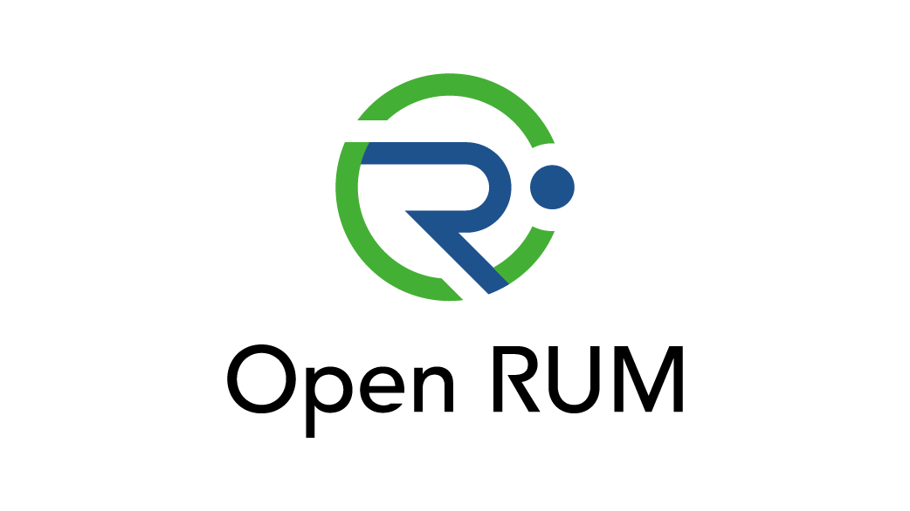

# OpenRUM Specification

- [语义约定（Semantic Conventions）](./semantic_conventions/README.md)
  - [标签（Tags）](./semantic_conventions/tags.md)
  - [会话-应用（Application）](./semantic_conventions/session_application.md)
  - [会话-用户（User）](./semantic_conventions/session_user.md)
  - [会话-设备（Device）](./semantic_conventions/session_device.md)
  - [事件-应用行为（Application）](./semantic_conventions/event_application.md)
  - [事件-视图（View）](./semantic_conventions/event_view.md)
  - [事件-用户操作（User Action）](./semantic_conventions/event_user_action.md)
  - [事件-网络请求（Request）](./semantic_conventions/event_request.md)
  - [事件-应用异常（Exception）](./semantic_conventions/event_exception.md)
  - [事件-系统（System）](./semantic_conventions/event_system.md)
  - [事件-自定义（Custom）](./semantic_conventions/event_custom.md)
  - [事件-现场属性（Scene）](./semantic_conventions/event_common.md)

## Acronym

OpenRUM，一种真实用户监控指标的标准协议；

## 规则说明

本规范中的关键词“必须（MUST）”、“不得（MUST NOT）”、“必需（REQUIRED）”、“应（SHALL）”、“不得（SHALL NOT）”、“应该（SHOULD）”、“不应（SHOULD NOT）”、“推荐（RECOMMENDED）”、“不推荐（NOT RECOMMENDED）”、“可（MAY）”和“可选（OPTIONAL）”应解释为BCP 14[RFC2119][RFC8174]中所述，当且仅当它们出现在所有大写字母中时，如此处所示。

如果本规范的实施未能满足本规范中定义的一个或多个“必须（MUST）”、“不得（MUST NOT）”、“要求（REQUIRED）”、“应（SHALL）”或“不应（SHALL NOT）”要求，则本规范的执行不符合要求。相反，如果规范的实施满足规范中定义的所有“必须（MUST）”、“不得（MUST NOT）”、“要求（REQUIRED）”、“应（SHALL）”或“不应（SHALL NOT）”要求，则符合规范。
